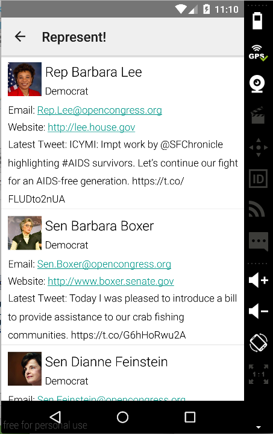
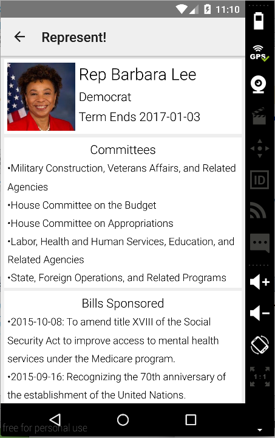

# PROG 02: Represent!

Represent is an Android app that allows users to view information on Congressional representatives in different areas.  The app uses a combination of a mobile device and smartwatch to provide the user with a variety of options. On the mobile device, the user can enter their zip code or use their current location to view the representatives for the given area. A display of the representatives then show up on both the watch and mobile device, and the user can click on a representative (on either the mobile device or smartwatch) to view more details of the representative.  On the watch, the user can further view details of the 2012 presidential election for the given area after swiping through all representatives.  The user can also shake the watch to randomize the location and representatives.

## Authors

Zachary Green ([zach.green@berkeley.edu](mailto:zach.green@berkeley.edu))

## Demo Video

See [Represent Walkthrough] (https://youtu.be/LRSRP9TbTls)

## Screenshots

## Acknowledgments
